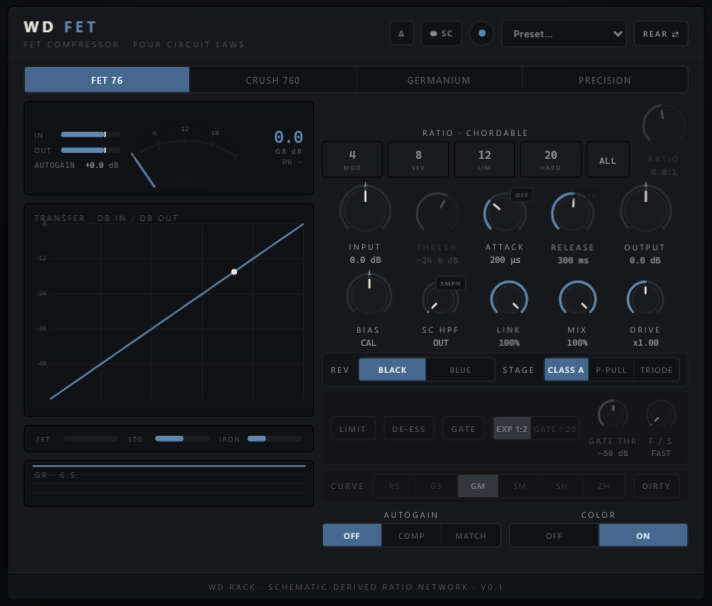
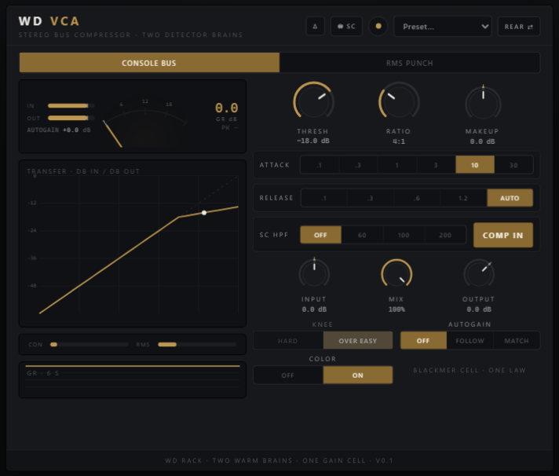
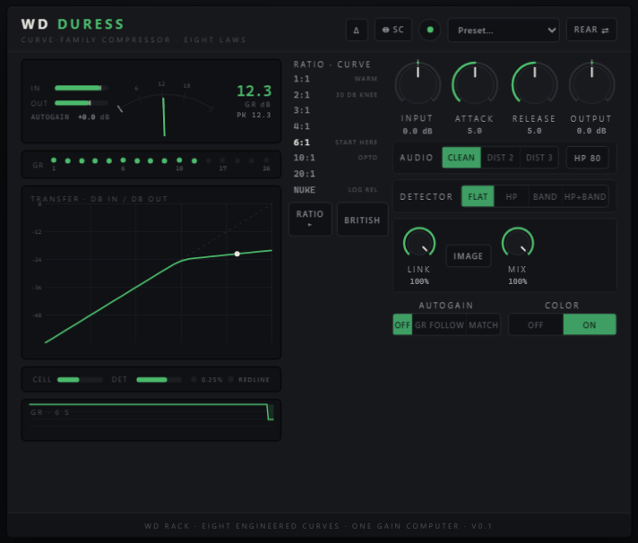
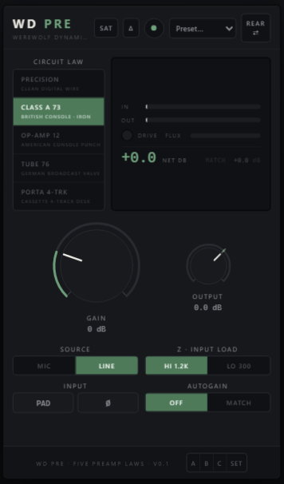
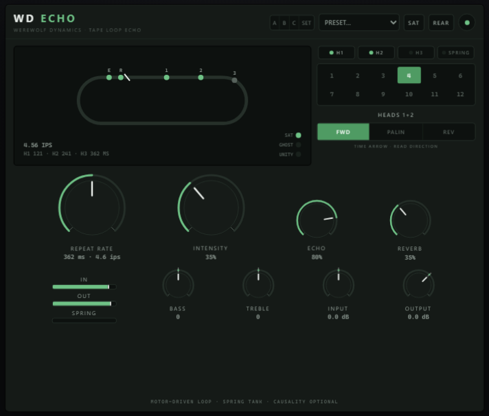
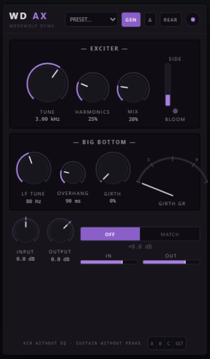
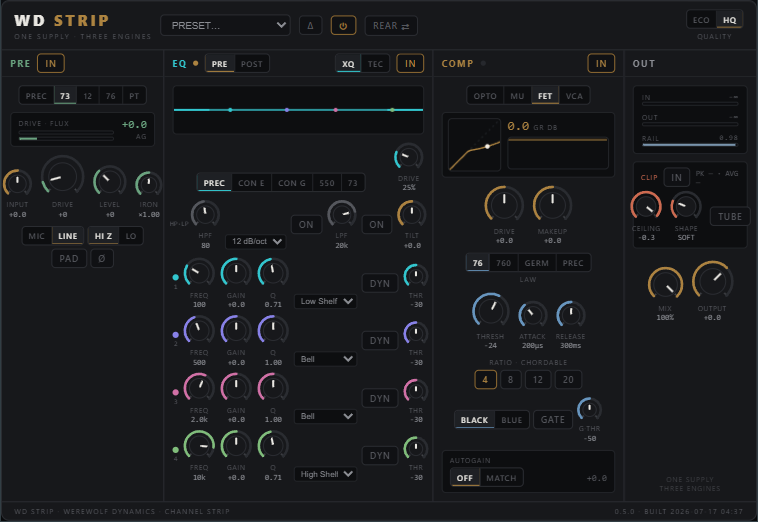
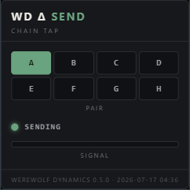
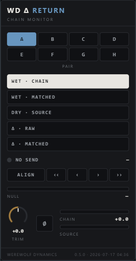

# Werewolf Dynamics

Analog gear, simulated from the circuit up.

Most "analog modeled" plugins are a snapshot: measure the hardware, fit some
curves, ship the curves. These solve the actual circuit while your audio runs
through it. The tube bias shifts when you hit it hard. The transformer core
saturates from flux, so it cares about frequency, not just level. The opto
cell remembers what you played ten seconds ago. Nothing is drawn on; if a
meter moves or a curve bends, something in the circuit did it.

And since the whole circuit is in there, you get the screwdriver too. Every
module has a rear panel with the service trims the hardware kept locked
inside: supply draw, bias, transformer headroom, tube swaps. Set them to
factory and it behaves like a well-kept unit. Or don't.

All free. Grab the zip from the
[Releases page](../../releases).

## 🎧 Hear it first

**[Audio demos — listen in your browser](https://xbombjackx.github.io/werewolf-dynamics-releases/)**

Eleven A/B demos, one mechanism each. Every variant of a demo is the same
performance, sample-locked — switching circuits mid-playback is a 12 ms
crossfade, so what changes is only the circuit. Loudness-matched, no
mastering, no cheating.

## The lineup

**WD Opto** — optical tube compressor in the LA-2A bloodline. The photocell
is the real thing: two time constants, program-dependent memory, that slow
settling tail. Two voicings (tube WD-2A, solid-state WD-3A) plus drive and
iron controls the original never gave you.

**WD Mu** — variable-mu compressor built around a simulated 6386 push-pull
stage and the classic six-position time-constant bank. No threshold knob,
because the circuit doesn't have one; you drive it and it leans back. Bias
knob on the front, mismatched tube pairs on the back.

**WDTec** — passive tube EQ, program and midrange sections in one wide
module. The boost you can't get wrong, with a twist: the filter inductors
have live magnetic cores, and a Core knob sets how hard you push them.

**WD Tape** — a full tape machine. Record head, bias oscillator, reproduce
head, all of it, aligned by the same procedure a tech would use on the
hardware. Two stock formulations. Every unit number ships with its own
transport quirks.

**WD XQ** — one parametric EQ, five circuits. Precision digital, two console
flavors, a stepped American classic, and an inductor design from 1973. The
knobs stay put while the circuit underneath changes what they're allowed to
do. Dynamic bands on all five.

**WD FET** — FET compressor with four circuit laws in one box: the 76
everyone reaches for, a crushed 760 sibling, a germanium path, and a clean
precision law. The ratio network is solved from the 1176LN drawing, so
all-buttons works because the circuit does it, not because we faked the
curve. Attack is measured in microseconds.

**WD VCA** — stereo bus compressor built around one Blackmer-style gain
cell. Two detector brains: Console Bus leans the whole mix back the way the
famous desk compressor does, RMS Punch is for the drum bus. Auto release,
over-easy knee, and the RMS detector's attack table falls out of one
capacitor, same as the hardware.

**WD Duress** — a curve-family compressor in the Distressor spirit. Every
ratio position is its own engineered curve: 1:1 is warm-up distortion with
no compression at all, 10:1 borrows an opto release with a twenty-second
tail, and Nuke is a log-release brickwall. Three distortion modes, two
stereo link laws taken from the block diagram, and a British Mode switch
that overrides the envelope the way all-buttons abuse does.

**WD Pre** — five preamps behind one gain knob. Precision digital wire, a
Class A British console with its iron, an American op-amp console, a German
broadcast valve, and a cassette 4-track desk channel. Gain redistributes the
circuit, so every detent is a slightly different amplifier; output is only a
fader after the iron.

**WD Echo** — tape loop echo where the loop is real enough to have a splice.
Motor-driven transport, three repro heads, spring tank. Repeat rate is a
motor, not a delay dial: turn it and everything already on the loop bends
with the transport. The time arrow reads the tape forward, palindrome, or
straight-up backward.

**WD AX** — the exciter, built from the patents instead of around them. It
adds a generated sideband rather than boosting EQ, so the fundamental never
moves. The Big Bottom section lifts the decay of a note instead of its hit:
sustain without the overload penalty.

**WD Rack** — the chassis. Put it on your master bus, give your modules the
same frame number, and suddenly they're screwed into the same box: shared
power supply that sags when a neighbor works hard, adjacent-slot bleed, a
slot map you can reorder. Crank the crosstalk and the rack becomes an effect
of its own. Skip it entirely and every module runs clean standalone.

**WD Strip** — a console channel in one window: preamp into EQ into
compressor, a model selector on each stage. Any of the five Pre laws, either
EQ, any of the four compressors. All three stages hang off one power rail
inside the same process, so the compressor's knee moves when the preamp
leans on the supply. The response curve and compressor transfer on the face
are measured live from the running engines, not drawn. No rack required.

**WD Delta** — a send/return pair that lets you hear what your whole chain
is doing: any plugins, anyone's. SEND taps the untouched signal at the top,
RETURN sits at the end, measures the chain's real latency by correlation,
and monitors the difference — raw, or level-matched so louder never reads
as different. A DRY mode gives you instant whole-chain bypass with no PDC
hiccup, and WET MATCHED plays the chain loudness-matched to its input: the
honest way to A/B your own processing.

 

## Requirements

Windows 10 or 11, 64-bit, and any VST3 or CLAP host.

## Install

Unzip the release. Copy the `.vst3` folders into
`C:\Program Files\Common Files\VST3`, or the `.clap` files into
`C:\Program Files\Common Files\CLAP` (create it if it doesn't exist —
per-user alternative: `%LOCALAPPDATA%\Programs\Common\CLAP`). Pick one
format per plugin, then rescan in your DAW. Everything shows up under
Werewolf Dynamics.

Beta builds are not code-signed yet, so Windows may grumble on first
download. Expected for now.

## Bugs

Open an [issue](../../issues) with your DAW, sample rate, and the plugin
version. Betas move fast, so check you're on the latest release first.

## License

Free to use on anything you make, commercial included. Not open source, and
please don't re-host the files; see [LICENSE.txt](LICENSE.txt) for the short
plain-English version. Built with [JUCE](https://juce.com) and the Steinberg
VST 3 SDK. VST is a registered trademark of Steinberg Media Technologies GmbH.
