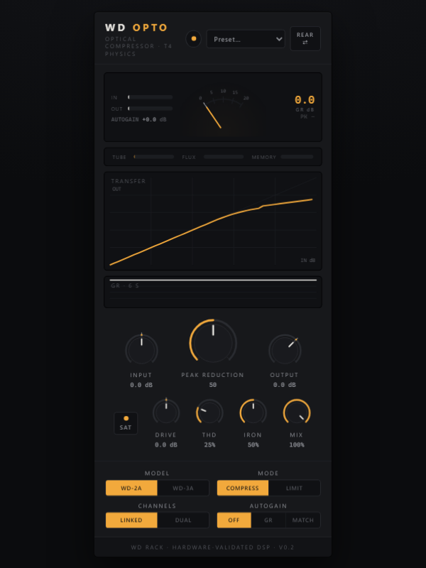
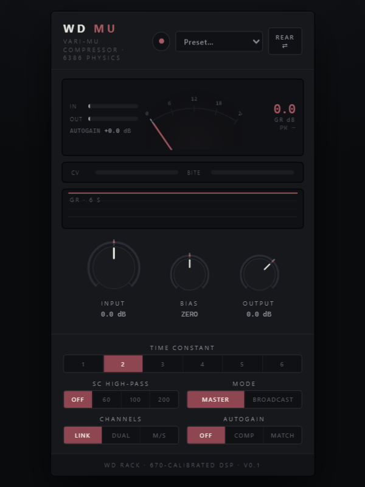
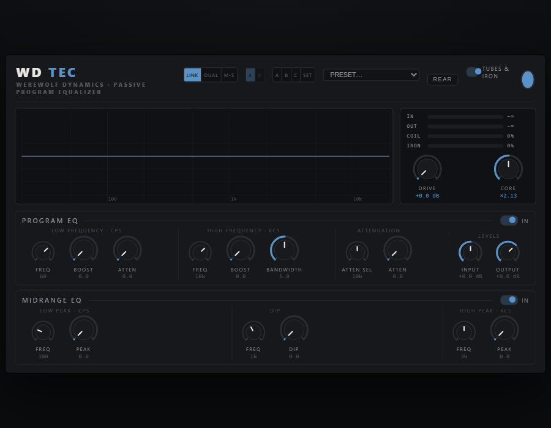
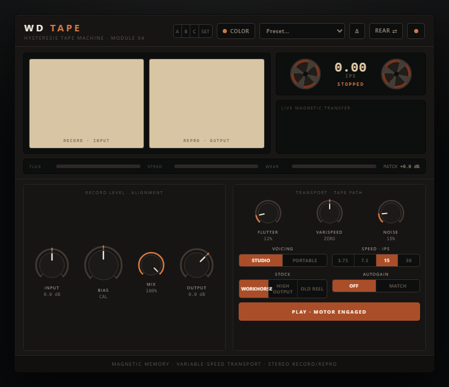
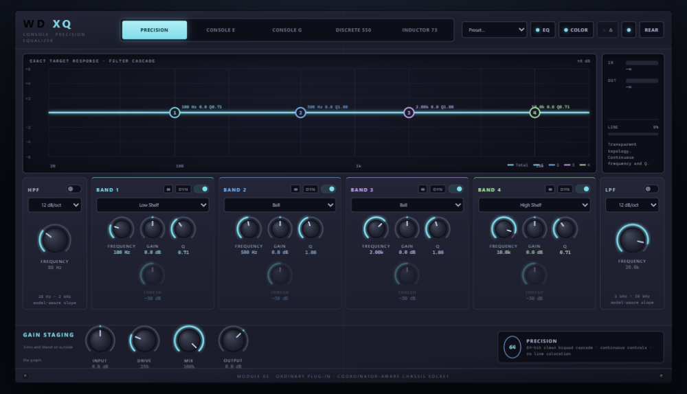
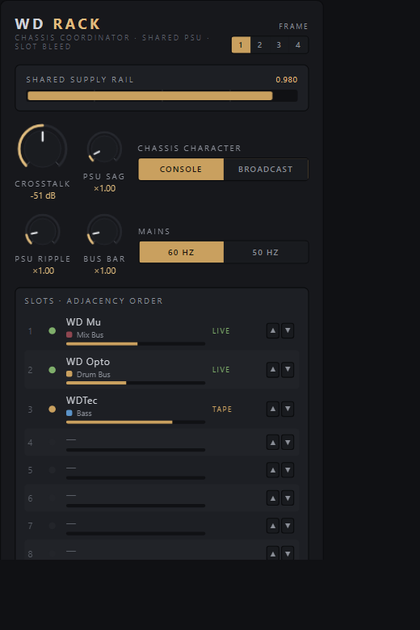

# Werewolf Dynamics

Analog gear, simulated from the circuit up.

Most "analog modeled" plugins are a snapshot: measure the hardware, fit some
curves, ship the curves. These solve the actual circuit while your audio runs
through it. The tube bias shifts when you hit it hard. The transformer core
saturates from flux, so it cares about frequency, not just level. The opto
cell remembers what you played ten seconds ago. Nothing is drawn on; if a
meter moves or a curve bends, something in the circuit did it.

And since the whole circuit is in there, you get the screwdriver too. Every
module has a rear panel with the service trims the hardware kept locked
inside: supply draw, bias, transformer headroom, tube swaps. Set them to
factory and it behaves like a well-kept unit. Or don't.

All free. Grab the zip from the
[Releases page](../../releases).

## The lineup

**WD Opto** — optical tube compressor in the LA-2A bloodline. The photocell
is the real thing: two time constants, program-dependent memory, that slow
settling tail. Two voicings (tube WD-2A, solid-state WD-3A) plus drive and
iron controls the original never gave you.

&nbsp;&nbsp;

**WD Mu** — variable-mu compressor built around a simulated 6386 push-pull
stage and the classic six-position time-constant bank. No threshold knob,
because the circuit doesn't have one; you drive it and it leans back. Bias
knob on the front, mismatched tube pairs on the back.

**WDTec** — passive tube EQ, program and midrange sections in one wide
module. The boost you can't get wrong, with a twist: the filter inductors
have live magnetic cores, and a Core knob sets how hard you push them.

**WD Tape** — a full tape machine. Record head, bias oscillator, reproduce
head, all of it, aligned by the same procedure a tech would use on the
hardware. Two stock formulations. Every unit number ships with its own
transport quirks.

**WD XQ** — one parametric EQ, five circuits. Precision digital, two console
flavors, a stepped American classic, and an inductor design from 1973. The
knobs stay put while the circuit underneath changes what they're allowed to
do. Dynamic bands on all five.

**WD Rack** — the chassis. Put it on your master bus, give your modules the
same frame number, and suddenly they're screwed into the same box: shared
power supply that sags when a neighbor works hard, adjacent-slot bleed, a
slot map you can reorder. Crank the crosstalk and the rack becomes an effect
of its own. Skip it entirely and every module runs clean standalone.

## Requirements

Windows 10 or 11, 64-bit, and any VST3 host.

## Install

Unzip the release and copy the `.vst3` folders into
`C:\Program Files\Common Files\VST3`, then rescan in your DAW. Everything
shows up under Werewolf Dynamics.

Beta builds are not code-signed yet, so Windows may grumble on first
download. Expected for now.

## Bugs

Open an [issue](../../issues) with your DAW, sample rate, and the plugin
version. Betas move fast, so check you're on the latest release first.

## License

Free to use on anything you make, commercial included. Not open source, and
please don't re-host the files; see [LICENSE.txt](LICENSE.txt) for the short
plain-English version. Built with [JUCE](https://juce.com) and the Steinberg
VST 3 SDK. VST is a registered trademark of Steinberg Media Technologies GmbH.
